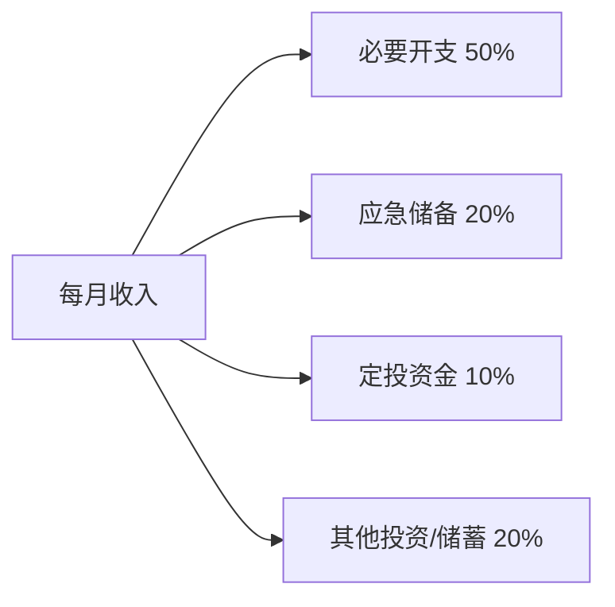

---title: 'DCA 定投策略：用币安实现加密货币定期投资'
date: 2026-06-28T00:00:00+08:00
draft: false
description: 'DCA定投助你摆脱追涨杀跌魔咒！一文看懂加密货币DCA定投原理，手把手教程教你用币安设置自动定投计划，涵盖标的选取与周期优化，全面对比定投、网格交易与一次性投入策略优劣。'
slug: 'binance-dca-guide'
tags: ['币安', 'Binance', 'DCA定投', '定投策略', '长期投资', '被动投资', '交易策略', '加密货币投资']
categories: ['交易策略']
---

> 大部分人在牛市顶部冲进去买，在熊市底部恐慌卖掉——这是人性，不是蠢。
>
> 有没有一种策略，能让你**不管市场怎么走，长期来看都是赚钱的**？
>
> 有。DCA 定投就是那个看似简单却被反复验证有效的答案。

> 💡 **还没有币安账号？** [立即注册](https://www.bsmkweb.cc/register?ref=GMVOGIBL)，输入邀请码 **GMVOGIBL** 享 20% 手续费返佣。

## 一、什么是 DCA 定投？

DCA（Dollar-Cost Averaging，美元平均成本法）是一种**定期投入固定金额买入某项资产的策略**，不管价格高低、不管市场涨跌。

### 核心逻辑

```
固定金额 × 固定周期 = 价格低时买得多，价格高时买得少
```

**举个例子：**

你决定**每星期定投 100 USDT 买入 BTC**：

| 周次 | BTC 价格 | 100 USDT 买到多少 BTC |
|:---:|:-------:|:-------------------:|
| 第 1 周 | 70000 | 0.001428 BTC |
| 第 2 周 | 65000 | 0.001538 BTC |
| 第 3 周 | 55000 | **0.001818 BTC** ✅ 跌了买更多 |
| 第 4 周 | 60000 | 0.001667 BTC |
| 第 5 周 | 75000 | 0.001333 BTC ❌ 涨了买更少 |
| 第 6 周 | 72000 | 0.001389 BTC |
| **总计** | **均价 66,122** | **0.009173 BTC** |

**关键发现：** 这 6 周 BTC 的均价是 **66,122**，但你通过定投实际买入的平均成本只有 **65,385**——因为跌的时候买得多了，涨的时候买得少了。

> 📌 **定投的秘密就是三个字：看平均。** 你不抄底也不逃顶，你只是「一直在买」。时间拉长，你的成本会自动低于平均价格。

### DCA 的数学原理

假设某资产价格波动，最终回到原点。一次性买入的人不赚不亏。定投的人呢？以下是不同价格走势下的结果：

| 价格走势 | 一次性买入 | DCA 定投 | 定投效果 |
|:--------|:--------:|:--------:|:--------|
| 📈 单边上涨 | 收益最高 | 收益较低 | 涨了买得少，跑输 |
| 📉 单边下跌 | 亏损最大 | 亏损较小 | 跌了买得多，摊低成本 |
| 🔄 先跌后涨（V 形） | 小赚 | **大赚** | **定投最理想的行情** |
| 〰️ 震荡 | 持平 | **盈利** | 低买多、高买少，自动做差价 |

**定投最适合的市场不是牛市，而是震荡或先跌后涨的市场。**

---

## 二、为什么 DCA 适合加密货币？

加密货币市场相比传统金融市场有几个显著特点，这些特点恰恰让 DCA 更有效：

### 特点 1：极高波动性

BTC 的年化波动率通常在 60-100%，是标普 500（15-20%）的 3-5 倍。高波动意味着价格「上蹿下跳」，而 DCA 正是利用波动来摊低成本的：

| 资产 | 年化波动率 | DCA 超额收益潜力 |
|:----|:---------:|:--------------:|
| 标普 500 ETF | 15-20% | 较低（波动小，摊低成本效果有限） |
| BTC | 60-100% | **较高（波动越大，摊低成本效果越明显）** |
| 山寨币 | 100-300% | 极高，但风险也高 |

### 特点 2：牛熊周期明显

比特币有大约 4 年一轮的减半周期——从牛市顶部到熊市底部，跌幅可以达到 70-80%。在这个周期中：
- **一次性在顶部买入** → 亏损 70-80%，需要 3-4 年才能回本
- **一次性在底部买入** → 完美抄底，但几乎没人能做到
- **持续定投** → 熊市低成本积累筹码，牛市获利离场

### 特点 3：情绪干扰极强

「别人贪婪我恐惧，别人恐惧我贪婪」——这句话人人都知道，但几乎没人做到。DCA 帮你做到的恰恰就是**去掉情绪决策**：不管市场是 FOMO 还是恐慌，系统自动买入。

### DCA 的历史回测

假设你在 2021 年 BTC 顶部（约 69000）开始定投——世界上最糟糕的入场时机：

| 策略 | 2021 年 11 月到 2023 年 12 月 |
|:----|:----------------------------:|
| 一次性在顶部买入 69000 | ⛔ 亏损 ~50%（多数人扛不住在底部割肉） |
| 每周定投 100 USDT | ✅ **2 年定投平均成本约 35000，到 2023 年底盈利 +50%** |

> 这是一个极端的例子，但它说明了一件事：**即使你在历史最高点开始定投，只要坚持下去，你最终仍然可以盈利。** 这是因为定投不靠「择时」，而是靠「时间的积累」。

---

## 三、如何在币安设置自动定投

币安提供了非常方便的 **「定投计划」（Auto-Invest）** 功能，可以让你一键开启自动化定投。

### 步骤一：进入定投页面

- **App 端：** 底部「理财」→ 顶部分页选择「定投计划」
- **网页端：** 理财 → 定投计划

### 步骤二：创建定投计划

```
┌──────────────────────────────────┐
│        创建定投计划               │
├──────────────────────────────────┤
│ 买入币种：  BTC                  │
│ 支付币种：  USDT                 │
│ 定投金额：  100 USDT             │
│ 定投频率：  每周                 │
│ 定投日期：  每周一               │
│ 开始时间：  立即开始              │
│ 支付账户：  现货钱包              │
└──────────────────────────────────┘
```

**参数解析：**

| 参数 | 说明 | 新手推荐值 |
|:----|------|:---------:|
| **买入币种** | 你要定投的资产 | BTC 或 ETH |
| **支付币种** | 用来购买的资金来源 | USDT 或 BUSD |
| **定投金额** | 每次投入的固定金额 | 月收入的 5-10% |
| **定投频率** | 多久投一次 | **每周**（推荐的平衡频率） |
| **定投日期** | 每周/每月的哪一天投 | 随意，选发薪日第二天最好 |

### 步骤三：确认并启用

1. 检查计划总览
2. 确认你的现货钱包余额充足
3. 点击「确认创建」
4. 计划自动开始执行

> 💡 **设置后可以做两件事：**
> 1. 开启「余额不足时跳过」——避免因为余额不够导致计划失败
> 2. 定期查看平均成本——币安 App 会帮你算出你的平均买入价

---

## 四、定投标的选择与策略

### 核心原则：只定投你长期看好的资产

加密市场有成千上万个币种，但值得定投的不到 5%。**不要定投你不了解的山寨币。**

| 定投标的 | 风险 | 预期年化 | 推荐程度 |
|:-------|:---:|:-------:|:-------:|
| **BTC** | ⭐ 低 | 10-30%（周期内） | ✅✅ 首选，区块链的基石资产 |
| **ETH** | ⭐ 低中 | 15-40%（周期内） | ✅✅ 第二选择，生态最活跃 |
| **BNB** | ⭐⭐ 中 | 20-50%（周期内） | ✅ 交易所龙头，有 Launchpad 加成 |
| **SOL** | ⭐⭐⭐ 中高 | 30-80%（波动极大） | ⚠️ 高风险高回报 |
| **山寨币** | ⭐⭐⭐⭐⭐ 极高 | 不确定性极高 | ❌ 不推荐定投 |

### 定投组合方案

**保守型（稳健增值）：**
```
80% BTC + 20% ETH
```
适合：投资新手、风险承受能力较低、长期持有 3-5 年

**平衡型（攻守兼备）：**
```
60% BTC + 30% ETH + 10% BNB
```
适合：有一定加密知识、愿意承担中等波动、投资周期 1-3 年

**进取型（追求高收益）：**
```
40% BTC + 30% ETH + 20% BNB + 10% SOL
```
适合：熟悉加密市场、能承受 50%+ 回撤、投资周期 3 年以上

### 定投频率优化

| 频率 | 优势 | 劣势 | 推荐度 |
|:---|:----|:----|:-----:|
| **每日** | 最平滑的成本曲线，波动捕捉最充分 | 操作次数多，适合大额资金 | ⭐⭐⭐ |
| **每周** | **平衡收益与操作频率** | 完美平衡 | **✅⭐⭐⭐⭐ 最推荐** |
| **每两周** | 手续费更少 | 可能错过急跌买入机会 | ⭐⭐⭐ |
| **每月** | 最简单，手续费最低 | 平滑效果差 | ⭐⭐ |

> 📌 **研究数据表明：** 每周和每日定投的长期收益差异极小（不到 1%），但每周的操作量是每日的 1/7。所以**每周定投是综合最优解**。

### 定投金额的设定原则

| 收入水平 | 建议月定投金额 | 占月收入比例 |
|:--------|:------------:|:----------:|
| 月入 5000 USDT 以下 | 50-100 USDT/月 | 5-10% |
| 月入 5000-10000 USDT | 200-500 USDT/月 | 5-10% |
| 月入 10000-50000 USDT | 500-2000 USDT/月 | 5-10% |
| 月入 50000 USDT 以上 | 2000-10000 USDT/月 | 5-10% |

**黄金法则：定投的金额应该是「亏了也不影响生活」的量。** 如果你觉得「这个月的定投让我紧张了」，那就降低金额。

---

## 五、定投策略的最佳执行方式

### 策略一：傻瓜定投（适合所有人）

**操作：**
1. 设定每周固定金额定投 BTC
2. 开启自动执行
3. 除非紧急情况，**不要看盘、不要手动干预**
4. 坚持至少 1 个完整周期（约 3-4 年）

**结果：** 大概率跑赢 80% 的主动交易者

### 策略二：动态定投（进阶版）

在傻瓜定投的基础上，增加一个「动态调整」规则：

```
当前 BTC 跌幅 > 30% → 定投金额翻倍
当前 BTC 涨幅 > 50% → 定投金额减半
```

**效果：** 极端行情中买更多（熊市底部）、涨太多时少买（控制追高风险）。收益比傻瓜定投高 10-20%。

> ⚠️ **动态定投需要纪律。** 最怕的是「跌了不敢加倍投、涨了舍不得减半」。如果你不确定自己能严格执行，就选傻瓜定投。

### 策略三：定投 + 止盈策略

定投解决的是「怎么买」的问题，不解决「怎么卖」的问题。一个完整的定投策略需要搭配卖出策略：

| 止盈方式 | 操作方法 | 特点 |
|:--------|---------|:----|
| **目标止盈** | 累计收益达到 X%（如 100%）→ 全部卖出 | 简单粗暴，适合新手 |
| **分批止盈** | 每涨 20% 卖出 1/3 | 平滑退出，不容易卖在最低 |
| **移动止盈** | 从最高点回落 20% 时卖出 | 能吃到大部分涨幅，牛市不会过早下车 |

**案例：BTC 定投 + 分批止盈**
```
入场：2022 年熊市底部开始定投 BTC（每周 100 USDT）
过程：一路定投到 2024 年减半前
第 1 次止盈：BTC 突破 100000（卖出 1/3）
第 2 次止盈：BTC 突破 150000（再卖出 1/3）
第 3 次止盈：BTC 突破 200000（卖出剩余部分）
或者：从最高点回落 20% → 全部卖出
```

### 资金管理



**关键原则：**
- **定投的钱必须是「可以不用的闲钱」** — 急用钱时被迫在低点卖出是定投最大的敌人
- **不要借钱定投、不要上杠杆定投** — 定投的本质就是去杠杆、去负债
- **先建立 3-6 个月的生活应急基金，再开始定投**

---

## 六、DCA 定投 vs 其他策略对比

### 与一次性买入对比

| 维度 | 一次性买入（Lump Sum） | DCA 定投 |
|:----|:-------------------:|:--------:|
| 需要择时 | ✅ 非常重要 | ❌ 不需要 |
| 牛市中收益 | ✅ 最高 | ❌ 跑输 |
| 熊市中亏损 | ❌ 最大 | ✅ 缩小亏损 |
| 情绪压力 | 极高（买在顶部会崩溃） | 低（跌了反而开心——买得便宜） |
| 对新手友好度 | 低 | **高** |

> **结论：** 如果你有一笔闲置资金：**全部一次性买入**的历史胜率高于分批定投（因为市场长期上涨）。但对于大多数人来说，更好的方式是把大额资金拆成 6-12 个月定投——既不会踏空，也不会抄底抄在半山腰。

### 与网格交易对比

| 维度 | 网格交易 | DCA 定投 |
|:----|:-------:|:--------:|
| **核心逻辑** | 在震荡中反复低买高卖 | 定期买入，拉平成本 |
| **最适合行情** | 震荡市场 | 先跌后涨（V 形） |
| **牛市表现** | ❌ 踏空 | ✅ 不错但跑输一次性 |
| **熊市表现** | ❌ 亏损 | ✅ 积累便宜筹码 |
| **操作复杂度** | 中（需要设参数） | **低（设好就不用管）** |
| **是否需要盯盘** | 偶尔检查 | **完全不需要** |
| **收益来源** | 波动收益 | 长期增长 + 低成本 |

> 📌 **最佳搭配：震荡市开网格 + 下跌市加码定投 + 牛市分批止盈。** 如果你能把这三件事做好，你基本就拥有了穿越完整牛熊的能力。

### 与合约交易对比

| 维度 | 合约交易 | DCA 定投 |
|:----|:-------:|:--------:|
| 风险 | ⭐⭐⭐⭐⭐ 极高（可能爆仓清零） | ⭐ 低（不会归零） |
| 收益 | 可能一夜翻倍 | 长期稳定 10-30% 年化 |
| 时间投入 | 需要大量研究（技术分析、链上数据） | 几乎不需要 |
| 胜率 | 低于 50%（多数交易者亏损） | **接近 100%（只要时间够长）** |
| 适合人群 | 经验丰富的专业交易者 | **所有投资者** |

---

## 七、常见问题 FAQ

### Q1：定投真的能赚钱吗？

**真的能，但有前提条件：**
1. 你定投的资产必须是长期向上的资产（BTC、ETH 等主流币）
2. 你坚持的时间要足够长（至少跨越一个完整周期）
3. 你在市场极度恐慌时**没有放弃定投**
4. 你在市场极度狂热时**记得止盈**

满足以上四个条件，DCA 定投是普通人在加密市场中**胜率最高的策略**。

### Q2：熊市还要继续定投吗？

**要，而且熊市是定投最好的时机。** 熊市中价格便宜，同样的钱能买到更多的筹码。如果因为恐慌而在熊市停止定投，那你在牛市高位开始定投就没有意义了。

**换个角度想：** 超市大促销的时候，你会选择不买东西吗？熊市就是加密货币的「大促销」。

### Q3：定投 BTC 还是 ETH 好？

| 维度 | BTC | ETH |
|:----|:---|:---|
| 波动性 | 较低 | 较高 |
| 上涨弹性 | 较稳 | 爆发力更强 |
| 下行保护 | 最强（最抗跌） | 中等 |
| 长期逻辑 | 数字黄金，储值资产 | 去中心化计算平台 |

**建议：** 保守选 BTC，激进选 ETH，平衡就 6:4 或 5:5 同时定投。

### Q4：什么时候应该停止定投？

两种情况：
1. **你不再看好这个资产的长期前景** — 那就不应该定投
2. **这笔钱变成了你的「生活必需」** — 如果你需要靠卖币来支付生活开支，应该暂停

除此之外，**不要因为短期亏损或恐慌而停止定投。**

### Q5：定投需要设置止损吗？

**不需要。** 定投本来就是通过「越跌越买」来摊低成本的。如果设了止损，你会在市场最便宜的时候被迫卖出，完全违背了定投的初衷。

**需要的是「止盈」**——在盈利足够的时候把利润锁定。

### Q6：币安定投有手续费吗？

币安定投计划本身不收取额外手续费。但在每次买入执行时，会收取标准的**现货交易手续费（0.1%）**。使用 BNB 抵扣手续费可以降至 0.075%。

## 总结

DCA 定投不是一个花哨的策略，但它可能是**普通人在加密世界里最可靠的长期赚钱方法**：

1. ✅ **不需要研究 K 线、不需要盯盘、不需要判断涨跌** — 设好计划忘掉它
2. ✅ **熊市积累便宜筹码，牛市自然获利** — 时间是你的朋友
3. ✅ **纪律性执行，战胜人性弱点** — 系统帮你执行，情绪不来干扰
4. ✅ **风险最低的加密投资策略之一** — 只要你选对了资产、坚持了时间
5. ❌ **唯一的敌人只有一个：你半途而废**

**给不同阶段用户的最终建议：**

| 用户类型 | 建议 |
|:--------|------|
| **新手** | 每周定投 50-100 USDT 的 BTC，设好自动计划，删掉交易所 App，一年后再看 |
| **进阶** | BTC + ETH 组合定投，搭配动态调整规则（跌了加倍 + 涨了减半） |
| **高级** | 定投 + 网格 + 手动大额买入三合一，配合完整的止盈策略穿越牛熊 |

**定投这招，听起来太简单了？对的，它就是这么简单。也正因为简单，大多数人做不到。** 不是因为它难，而是因为人们总觉得自己能找到更快的赚钱方法。而时间会证明，那个「最简单的方案」往往是「最有效」的。

---

📌 **更多学习资源**
想了解更多加密货币知识和实操技巧？欢迎访问 [CoinVado - 新手进入链上资产世界的第一站](https://coinvado.com/zh/)，这里有更系统的教程、视频和最新资讯，帮助你在币圈少走弯路。

---

<div class="callout callout-info">
<div class="callout-title">📌 免责声明</div>
<p>本文为 DCA 定投策略教学指南，不构成任何投资建议。定投虽然是一种降低风险的投资策略，但不能保证盈利。加密货币市场波动剧烈，历史表现不代表未来收益。请根据自身财务状况和风险承受能力谨慎决策，定投的金额应为闲置资金。</p>
</div>
